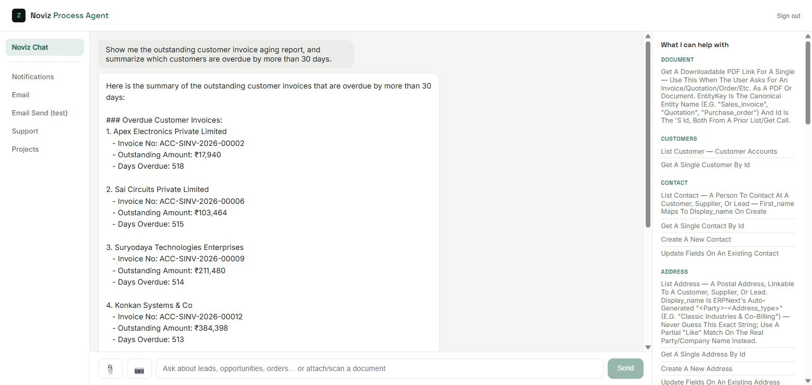
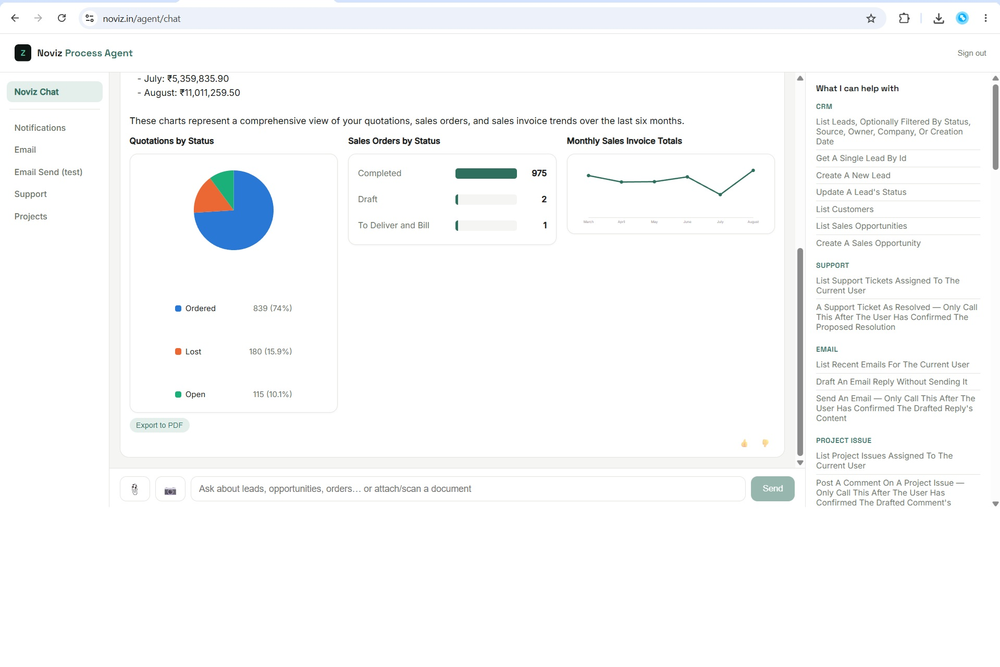

# ERP Agent AI (Free / Self-Hosted)

An extensible, role-based AI agent for ERP systems. This is the **free, open-source,
self-hosted build**: the complete agent — the core engine (module registry,
entity/workflow/report factories, auth, context assembly, LLM tool-calling loop), a
working reference connector for **ERPNext**, full canonical doctype coverage across
**all eleven standard ERP domains** (CRM, Selling, Buying, Stock, Accounting, HR,
Manufacturing, Projects, Assets, Quality, Support), a real multi-role permission map,
business-rule validation, the analytics toolbox (exact sums / counts / averages /
correlations / charts, never model-estimated), named-report tools, PDF export, a
document-scan pipeline, and a conditional, per-domain system prompt.

It connects **directly** to your own ERP instance and runs as a single deployment for
one organization. There is no relay, no multi-tenant layer, no subscription — a
separately-licensed hosted SaaS build adds those on top of this same engine.

Sample data and prompts: `sample-data/`, `docs/SAMPLE_PROMPTS.md`.

## Screenshots

Real agent output, signed in against a live ERPNext instance:

| Outstanding invoice aging | Multi-chart dashboard (pie + bar + line) |
|---|---|
|  |  |

📝 **Write-up:** [AI Agents in the Enterprise: Building Smarter ERP Dashboards with Purpose-Built Tools](https://dev.to/tajdin_k_27861e95a3d49baa/-1k1) — the architecture behind the dashboard screenshot: fetch/shape/render as three separate, composable tools instead of one model call doing everything.

## What's in the box

- **Core engine** (`backend/src/core/`) — ERP-agnostic. Nothing here knows the word
  "ERPNext", a doctype name, or a native field name. `gateway.ts` is the single
  role-check + business-rule + execution point for every tool call.
- **Generic factories** — `entityModuleFactory` turns one declarative `EntityConfig`
  into `list/get/create/update` tools; `workflowToolFactory` turns a state-machine
  transition into an ordinary gated tool; `reportModuleFactory` turns a `ReportConfig`
  into a report tool. Adding an entity, a workflow, or a report is a config entry,
  never a new route.
- **Domain packs** (`backend/src/config/modules/<name>/{entity,rule,training}/`) —
  canonical entity/field names, business rules, and training metadata for all eleven
  domains. The ERPNext-specific translation lives entirely in
  `backend/src/erpnext/entityMaps/<name>.ts`, mirrored one-to-one.
- **Hand-written tool modules** (`backend/src/modules/`) — analytics, chart,
  data-table / SQL-style query, schema discovery, tool discovery, report generation,
  inbox actions, payment entry, document PDF, external mailbox/helpdesk stubs.
- **System prompt** (`backend/src/systemPrompt/`) — a thin always-on core plus
  per-domain guidance selected by keyword, plus per-tool rule blocks attached to the
  tools that need them.
- **Two React apps** (`frontend/agent`, `frontend/admin`) — the chat UI and the
  operational-settings console.
- **Per-user impersonation** — every business-data call runs on ERPNext as the actual
  logged-in person, so ERPNext's own audit trail stays correct. See
  `docs/ARCHITECTURE.md`.

## Adding your own ERP

Write `<system>/<system>Connector.ts` implementing `SystemConnector` and
`<system>/entityMaps/*.ts` mapping the canonical entity keys to that system's native
objects/fields, register it in `config/system.config.ts`, set `SYSTEM_PROVIDER`.
`entities.config.ts`, `roles.policy.ts`, every module, the gateway, the reasoning
engine, the renderers, and both frontends are unaffected — they never knew which
system they were talking to. `backend/src/sap/README.md` has the checklist.

## License

AGPL-3.0 (see `LICENSE`). If you run a modified version of this code as a network
service, you must make your modified source available to your users under the same
license.

## Structure

```
backend/       Node/TypeScript API server (core engine, config, connectors, routes)
frontend/
  admin/       Admin console (Vite + React)
  agent/       End-user chat/agent UI (Vite + React)
docs/          Architecture, install guide, testing guide, sample prompts, training plan
sample-data/   A real, small data snapshot — see sample-data/README.md
```

## Getting started

```bash
cd backend && npm install && cp .env.example .env && npm run dev
cd frontend/admin && npm install && cp .env.example .env && npm run dev
cd frontend/agent && npm install && cp .env.example .env && npm run dev
```

Fill in `backend/.env` (ERPNext URL + key, LLM key, `DATABASE_URL` with pgvector,
`CREDENTIAL_ENCRYPTION_KEY`), run every file in `backend/src/db/migrations/` against
your Postgres in filename order, then `npm run dev`.

See `docs/INSTALL.md` for the full step-by-step install (including installing ERPNext
itself and backing up/restoring its data), `docs/ARCHITECTURE.md` for how modules,
entities, and connectors fit together, `docs/TESTING_GUIDE.md` for the developer
quick-start, and `docs/SAMPLE_PROMPTS.md` for prompts to try once it's up.
